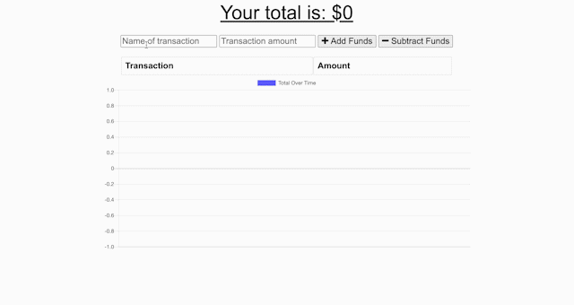

  # Progressive Budget Tracker

  ## Description
  A budget tracking app that allows users to record account deposits and withdrawals so that they can track their account balance and budget more effectively. Progressive Budget Tracker is a PWA(Progressive Web App) and features a web manifest, service worker and IndexedDB allowing app access and functionality outside of web browser even when offline. 

  
  ## Table of Contents
  * [Installation](#installation)
  * [Usage](#usage)
  * [Contributing](#contributing)
  * [Tests](#tests)
  * [Credits](#credits)
  * [License](#license)
  * [Questions](#questions)
  
  
  ## Installation
  The app is live [here](https://infinite-temple-98110.herokuapp.com/) 
  
  
  
  ## Usage
  Online functionality:
  

  Offline functionality:
  
  
  
  ## Contributing
  There are currently no guidelines for contributing, fork and edit to your hearts content.
  
  
  ## Tests
  There are currently no tests for this app.
  

  ## Credits
  * [gmg300](https://github.com/gmg300)
  

          
  
  
  ## License
  

  Copyright &copy;2020 Garrett Gassensmith 
  
  
  ## Questions
  
  
  For questions or feedback email me at garrettgassensmith@gmail.com  
